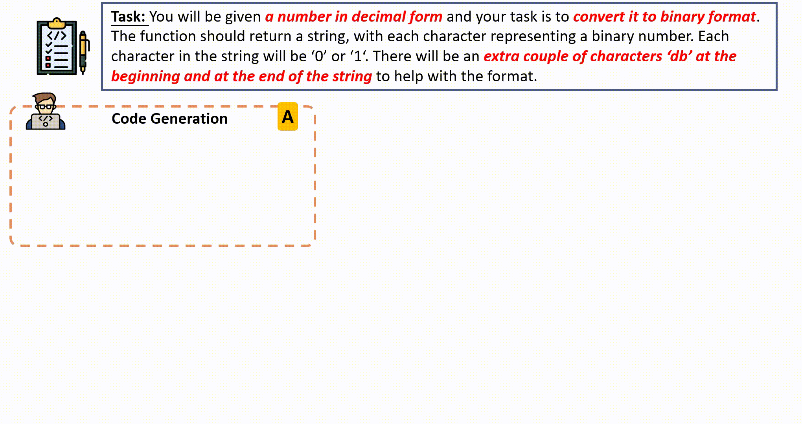

<div align="center">
<h1 style="text-align: center;">INTERVENOR</h1>


</div>

Source code for paper: <a href='https://arxiv.org/abs/2311.09868'></a>
[INTERVENOR : Prompt the Coding Ability of Large Language Models with the Interactive Chain of Repairing](https://arxiv.org/abs/2311.09868)


## Overview
INTERVENOR conducts an interactive code-repair process, facilitating the collaboration among agents and the code compiler.

In the initial step (**Step A^0**, where 0 signifies the initial turn), we prompt the Code Learner to generate code for the given task. Subsequently, the Code Learner executes the generated code using the code compiler to assess its correctness (**Step B**). Following this, the Code Teacher generates code repair instructions (CoR) based on the bug report and the associated buggy code (**Step C**). These instructions elucidate the reason of the bug, such as ``modified to handle the case where the input decimal is 0``, and include code correction planning, for example, ``we can simply return db0db``. Such instructions are informative and enhance the guidance for the Code Learner. Ultimately, the Code Learner follows the chain-of-repair (CoR) to rectify the code and subsequently resubmits the corrected version to the compiler for execution in the subsequent turn ((**Step A^i**), where i≥1 denotes the code repair process). The A^i, B, and C steps are iterated sequentially until either the code meets the compiler's estimation or the maximum turn limit is reached.

## Requirements

Install dependencies:

```
git clone https://github.com/NEUIR/INTERVENOR.git
cd INTERVENOR
pip install -r requirements.txt
pip install -e human-eval
```


## Reproduce

### 1.Code Generation
Set your API KEY in [this](https://github.com/NEUIR/INTERVENOR/blob/532c9c26d4845d995b5d0cf38d9dcb32fe70b712/agents/gpt/gpt_wrapper.py#L9).

First, we need to generate initial code based on natural language descriptions.

```bash
python intervenor.py \
        --problem_file =human_eval/data/human-eval-v2-20210705.jsonl \
        --dataset humaneval \ # choices=["humaneval", "mbpp", "humanevalx", "codeerror"]
        --language python \ # choices=["python", "cpp", "java", "js"]
        --model gpt-3.5-turbo-instruct-0914 \
        --max_tokens 512 \
        --temperature 0.2 \
        --num_samples_per_task 1 \
        --todo code_generation # choices=["code_generation", "cor_generation", "code_reapir"]
```

The result file is saved in  `./results/code_generation/{dataset}/{language}.jsonl`.

After obtaining the initial generated code, it is necessary to test the generated code and retain the test results along with error information.

For more detailed testing steps, please refer to [HumanEval Repo](https://github.com/openai/human-eval)

```bash
evaluate_functional_correctness {result path} --problem_file={problem_path}
```

The test result file is saved in the `./results/code_generation/{dataset}/{language}.jsonl_results.jsonl`.


### 2.Chain-of-Reapiring (CoR) Generation

After obtaining the test results, we know which code is correct and which is incorrect. For erroneous code, we employ Code Teacher to provide the Chain-of-Repairing (CoR).

```bash
python intervenor.py \
        --problem_file =human_eval/data/human-eval-v2-20210705.jsonl \
        --dataset humaneval \
        --language python \
        --model gpt-3.5-turbo-instruct-0914 \
        --max_tokens 512 \
        --temperature 0.2 \
        --num_samples_per_task 1 \
        --todo cor_generation # change to cor_generation
```

The cor file is saved in  `./results/cor_generation/{dataset}/{language}_cor.jsonl`.


### 3.Code Repair

After obtaining the Chain-of-Repairing (CoR), we proceed to fix the buggy code and save the repaired code to  `./results/code_repair/{dataset}/{language}.jsonl`.

```bash
python intervenor.py \
        --problem_file =human_eval/data/human-eval-v2-20210705.jsonl \
        --dataset humaneval \
        --language python \
        --model gpt-3.5-turbo-instruct-0914 \
        --max_tokens 512 \
        --temperature 0.2 \
        --num_samples_per_task 1 \
        --todo code_repair # change to cor_repair
```

Then, we test the repaired code.

```bash
evaluate_functional_correctness {result path} --problem_file={problem_path}
```


## Prompts

INTERVENOR involves the integration of two agents, Code Learner and Code Teacher, who work interactively to repair the generated codes.  The prompts they use are as follows:

**Code Teacher：**

```
You are an experienced and insightful programming instructor, and you need to identify the bugs in the given code based on the error messages.

- buggy code:
%%%buggy_code%%%

When testing the above code, errors occurred: %%%error_message%%%, some test cases did not pass!
Please check the implementation of the function and provide a method for modification based on the error message. No need to provide the modified code.

Modification method:

```


**Code Learner：**

```
You are a student assistant with excellent code repair capabilities. You can attempt to fix the bugs in the above code based on the provided error information and the method for modification. Please make sure to carefully check every potentially problematic area and make appropriate adjustments and corrections.

- buggy code:
%%%buggy_code%%%

When testing the above code, errors occurred: %%%error_message%%% , some test cases did not pass! Please check the implementation of the function and fix the code based on the modification method.

- modification method:
%%%repair_method%%%

Correct the code:

```

For additional prompts, please refer to this [directory](./prompt) and our [paper](https://arxiv.org/abs/2311.09868).


## Citation

If you use our code or our data for your research, feel free to cite our publication:

```
@misc{wang2023intervenor,
      title={INTERVENOR: Prompt the Coding Ability of Large Language Models with the Interactive Chain of Repairing}, 
      author={Hanbin Wang and Zhenghao Liu and Shuo Wang and Ganqu Cui and Ning Ding and Zhiyuan Liu and Ge Yu},
      year={2023},
      eprint={2311.09868},
      archivePrefix={arXiv},
      primaryClass={cs.SE}
}
```


## Contact

Please send email to [wanghanbinpanda@gmail.com](mailto:wanghanbinpanda@gmail.com).
